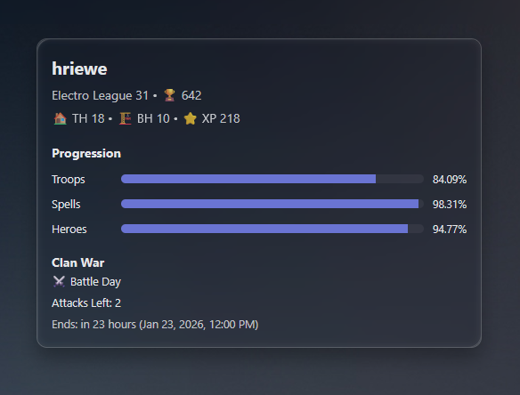

# Clash of Clans Lovelace Card

A custom Lovelace card for Home Assistant that displays Clash of Clans player information provided by the companion integration.

This card is intended to be used with the [ha-clash-of-clans](https://github.com/hriewe/ha-clash-of-clans) custom integration.

<p align="center">
  
</p>

## Features

- **Easy entity selection** (pick the player "Info" sensor)
- **Optional sections**
  - Progression (troops/spells/heroes)
  - Clan War (status, attacks left, end time)
- **War progress tracking**

## Requirements

- Home Assistant
- HACS (recommended)
- The Clash of Clans integration installed and providing entities (including `sensor.*_info`)

## Installation (HACS)

This repository is a **HACS Frontend** (Lovelace) custom repository.

### 1) Add as a Custom Repository

1. Open HACS
2. Go to **Frontend**
3. Open the menu (top right) and choose **Custom repositories**
4. Add:
   - Repository: `https://github.com/hriewe/lovelace-clash-of-clans`
   - Category: **Lovelace**

### 2) Install

1. In HACS → Frontend, search for **Clash of Clans Card**
2. Install

### 3) Add the Lovelace resource

After a refresh, the card should be available on your dashboards. If it does not show up, add this resource in Home Assistant:

- URL: `/hacsfiles/lovelace-clash-of-clans/clash-of-clans-card.js`
- Type: `module`

Then refresh your browser.

## Usage

Add the card to your dashboard, choose the account you want to display.

### Visual editor

If your Home Assistant version supports visual editors, you can pick the player directly using the entity selector.

### YAML example

```yaml
type: custom:clash-of-clans-card
entity: sensor.{{your_player_name}}_info
show_progression: true
show_war: true
```

## Configuration

| Name | Type | Default | Description |
|------|------|---------|-------------|
| `entity` | string | required | The player **Info** sensor entity (the card uses this to discover the rest of the player's entities). |
| `show_progression` | boolean | `true` | Show/hide the Progression section. |
| `show_war` | boolean | `true` | Show/hide the Clan War section. |

## Troubleshooting

- **Card says "Custom element doesn't exist"**
  - Verify the resource is added as `module`.
  - Verify the URL is `/hacsfiles/lovelace-clash-of-clans/clash-of-clans-card.js` (for HACS install).
  - Clear cache / hard refresh.

- **Entity picker is empty / card doesn't find related entities**
  - Ensure your integration entities have `player_tag` in state attributes.
  - Ensure you selected the player "Info" sensor (typically ends with `_info`).

## Contributing

Contributions are welcome! Please feel free to submit a Pull Request with your ideas/fixes.

## Development

### Setup

```bash
npm install
```

### Build

```bash
npm run build
```

Build output is written to:

- `dist/clash-of-clans-card.js`

## License

See `LICENSE`.